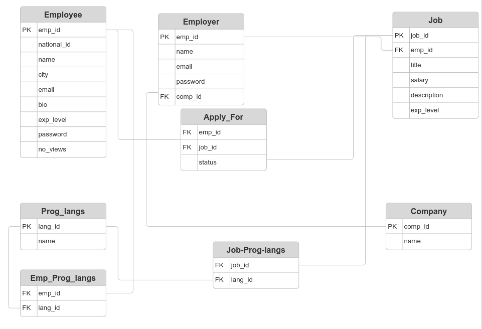
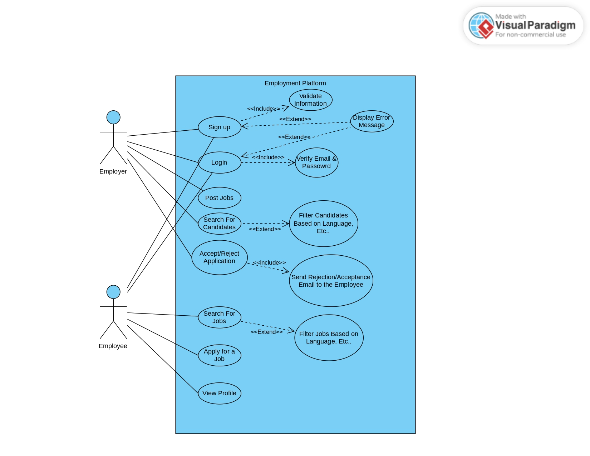

## 📝 Overview
The platform allows software developers (employees) to register, showcase their skills, search for job vacancies, and apply for positions. Employers can post job openings, search for suitable candidates, and manage applications.

## 👥 Stakeholders
- **Employees**: Search For Jobs and Apply For them.
- **Employers**: Post Jobs, Accept Job Applications, and Search for Employees.

## 📌 Functional Requirements
This platform provides the following capabilities for both Employees and Employers.

### 👨‍💻 Employee
- Sign up using email and set a password.
- Login using email & password.
- Search for jobs and filter them based on preference.
- Apply for a job.
- View profile information, including profile views.

### 🏢 Employer
- Sign up using email and set a password.
- Login using email & password.
- Post jobs with detailed descriptions.
- Search for employees and filter by criteria.
- Accept or reject job applications.

### 🔄 System
- Send acceptance or rejection emails to employees. *(Not done yet)*
- Suggest jobs to employees based on profile information.

## 🌟 Features
- User Authentication (Signup and Login)
- Job Posting and Application Management
- Job Search with Filtering Capabilities
- Profile Management for Employees
- Suggested Job Recommendations

## 📊 ER Diagram
The ER Diagram visualizes the relationships between different entities in the system.

## 🗄️ Relational Data Model
The Relational Data Model maps the ER diagram into relational tables for database design.

## 🔍 Use Case Diagram
This diagram highlights the core use cases for both Employees and Employers on the platform.

